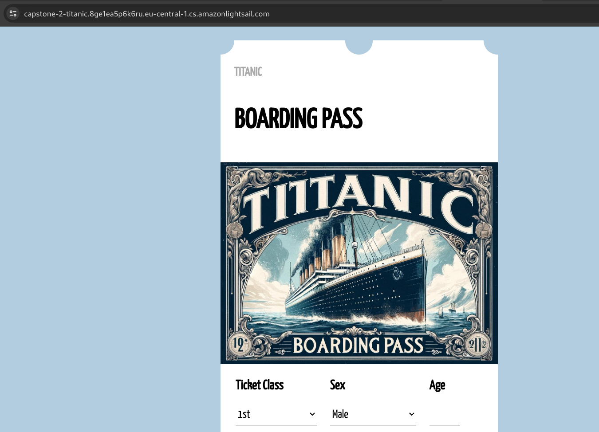
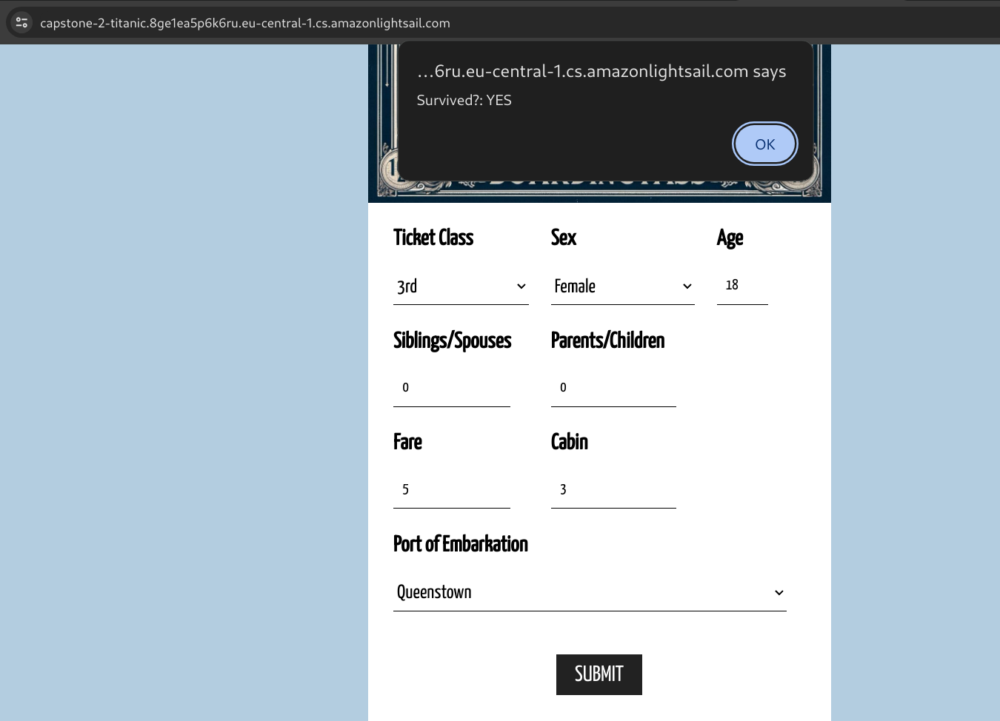

# ML Zoomcamp Capstone 2 project: Would you have survived on the Titanic?

> Link for testing: [https://capstone-2-titanic.8ge1ea5p6k6ru.eu-central-1.cs.amazonlightsail.com/](https://capstone-2-titanic.8ge1ea5p6k6ru.eu-central-1.cs.amazonlightsail.com/)

## Contents

- [Overview](#overview)
- [Problem Statement](#problem-statement)
- [Application](#application)
- [Installation](#installation)
  - [Prerequisites](#prerequisites)
  - [Setting Up the Project](#setting-up-the-project)
  - [Running the Application in Virtual Environment](#running-the-application-locally)
  - [Docker](#docker)
  - [Deploying to cloud using AWS Lightsail](#deploying-to-cloud-using-aws-lightsail)
- [Usage](#usage)
  - [Accessing the Web Interface](#accessing-the-web-interface)
  - [Using REST API Endpoints](#using-rest-api-endpoints)
- [Exploratory Data Analysis (EDA)](#exploratory-data-analysis-eda)
- [ML Models Used in This Project](#ml-models-used-in-this-project)
  - [Logistic Regression](#logistic-regression)
  - [Random Forest Classifier](#random-forest-classifier)

## Overview

"ML Zoomcamp Capstone 2 Project: Would You Have Survived on the Titanic?" is an engaging and interactive project that employs machine learning to predict survival probabilities for individuals aboard the Titanic. By utilizing a [dataset with passenger details](https://www.kaggle.com/datasets/brendan45774/test-file/data) like ticket class, sex, age, and more, the project aims to build models that accurately predict survival outcomes. This project not only offers insights into historical events but also serves as a fun and educational tool to understand the application of machine learning in historical data analysis.

## Problem Statement

The core objective of this project is to predict whether individuals would have survived the Titanic disaster, based on various passenger attributes. The dataset features include 'pclass' (ticket class), 'sex', 'age', 'sibsp' (number of siblings or spouses aboard), 'parch' (number of parents or children aboard), 'ticket' (ticket number), 'fare', 'cabin' (cabin number), and 'embarked' (port of embarkation). The primary challenge involves examining these attributes to determine their influence on survival outcomes. The project uses Logistic Regression and Random Forest models, fine-tuned for optimal prediction accuracy.

## Application

This project stands out for its engaging and user-friendly approach. Models are deployed as REST API services and a web-based UI, making the predictions accessible and easy to use for a wide range of audiences. Users can interact with the models in two ways:

1.  API Endpoint for Predictions: For those interested in a more technical approach, predictions can be obtained via a REST API endpoint. Users can send a POST request with passenger data to receive survival predictions. For example:

    ```sh
    curl -X POST -H "Content-Type: application/json" -d '{
        "Pclass": 1.0,
        "Sex": 1.0,
        "Age": 36.0,
        "SibSp": 1.0,
        "Parch": 0.0,
        "Fare": 75.25,
        "Embarked": 0.0
    }' https://capstone-2-titanic.8ge1ea5p6k6ru.eu-central-1.cs.amazonlightsail.com//predict/logistic_regression
    ```

    The API responds with a JSON formatted prediction, such as:

    ```json
    {
      "survived": "NO"
    }
    ```

2.  [User-Friendly UI Endpoint](https://capstone-2-titanic.8ge1ea5p6k6ru.eu-central-1.cs.amazonlightsail.com/): For a more accessible and interactive experience, the project also features a web-based UI. This allows users to easily input passenger data and receive predictions without needing technical expertise in API usage. The UI is designed to be intuitive and engaging, enhancing the educational and fun aspect of the project.

## Installation

### Prerequisites

- [Pipenv](https://pipenv.pypa.io/en/latest/#install-pipenv-today)
- [Docker](https://www.docker.com/products/docker-desktop)
- [AWS CLI](https://aws.amazon.com/cli/) (for AWS Lightsail deployment)

### Setting Up the Project

1.  Clone the Repository (skip if you have the project files):

    ```sh
    git clone https://github.com/lumenalux/mlzoomcamp-2023-capstone-2.git
    ```

    cd mlzoomcamp-2023-capstone-2`

2.  Set Up the Python Environment using Pipenv:

    ```sh
    # Navigate to the project directory if you haven't already
    cd mlzoomcamp-2023-capstone-2

    # Install dependencies from Pipfile
    pipenv install
    ```

3.  Activate the Pipenv Shell (virtual environment):

    ```sh
    pipenv shell
    ```

### Running the Application Locally

1.  Start the Flask App:

    ```sh
    python predict.py
    ```

2.  Run Tests:

    ```sh
    python test.py
    ```

### Docker

1.  Build the Docker Image:

    ```sh
    docker build -t capstone2 .
    ```

2.  Run the Docker Container Locally (optional):

    ```sh
    docker run -p 5000:5000 capstone2
    ```

### Deploying to cloud using AWS Lightsail

Deploying the application to AWS Lightsail is straightforward using the AWS CLI. Before you begin, ensure you have the AWS CLI installed and configured with the necessary credentials.

1.  Build the Docker Image (if not already built):

    ```sh
    docker build -t <your-image-name> .
    ```

2.  Push the Docker Image to AWS Lightsail:

    - Use the following command to push your Docker image to your Lightsail container service:

      ```sh
      aws lightsail push-container-image --service-name <your-lightsail-service-name> --label <your-image-label> --image <your-image-name>
      ```

    - Replace `<your-lightsail-service-name>`, `<your-image-label>`, and `<your-image-name>` with your specific details.
    - This command uploads your local Docker image to the Lightsail container service and prepares it for deployment.

3.  Deploy the Image in Lightsail:

    - Log in to the AWS Lightsail console.
    - Navigate to the 'Containers' tab.
    - Locate your container service (`<your-lightsail-service-name>`) and update the deployment with the new image labeled `<your-image-label>`.
    - AWS Lightsail will then handle the deployment process. Once completed, your application will be live.

4.  Access the Application:

    - After deployment, your application can be accessed through the public domain provided by AWS Lightsail.

## Usage

### Accessing the Web Interface

For a user-friendly experience, access the application's web interface by navigating to the following link:

https://capstone-2-titanic.8ge1ea5p6k6ru.eu-central-1.cs.amazonlightsail.com/

Here, you can interact with the model predictions through an intuitive UI:




### Using REST API Endpoints

The application provides several endpoints to make credit evaluation predictions using different machine learning models. You can send a POST request to these endpoints with the required data in JSON format.

#### Endpoints

- Random Forest Classifier:

  - URL: `https://capstone-2-titanic.8ge1ea5p6k6ru.eu-central-1.cs.amazonlightsail.com/predict/random_forest`
  - Local URL: `http://localhost:5000/predict/random_forest`

- Logistic Regression Classifier:

  - URL: `https://capstone-2-titanic.8ge1ea5p6k6ru.eu-central-1.cs.amazonlightsail.com/predict/logistic_regression`
  - Local URL: `http://localhost:5000/predict/logistic_regression`

#### Making a Prediction

To make a prediction, send a POST request to the desired endpoint with the required data. Here's an example using `curl`:

```sh
curl -X POST -H "Content-Type: application/json" -d '{
    "Pclass": 1.0,
    "Sex": 1.0,
    "Age": 36.0,
    "SibSp": 1.0,
    "Parch": 0.0,
    "Fare": 75.25,
    "Embarked": 0.0
}' https://capstone-2-titanic.8ge1ea5p6k6ru.eu-central-1.cs.amazonlightsail.com//predict/random_forest
```

## Exploratory Data Analysis (EDA)

An exploratory data analysis (EDA) for this project is provided in the [EDA.ipynb](EDA.ipynb) notebook. It contains visualizations and insights derived from the dataset.

## ML Models Used in This Project

### Logistic Regression

In this project, Logistic Regression is meticulously explored in the [train.ipynb](https://chat.openai.com/c/train.ipynb) notebook for predicting the survival probabilities of passengers aboard the Titanic. This model evaluates the likelihood of survival based on key features such as class, sex, age, and others.

Endpoint for Predictions:

`POST /predict/logistic_regression`

Performance Metrics:

```txt
              precision    recall  f1-score   support

           0       1.00      1.00      1.00        85
           1       1.00      1.00      1.00        41

    accuracy                           1.00       126
   macro avg       1.00      1.00      1.00       126
weighted avg       1.00      1.00      1.00       126
```

Given the unique nature of the dataset and the optimization techniques applied, the Logistic Regression model achieved a remarkable performance with 100% accuracy. This high level of precision reflects the model's exceptional ability to discern patterns and relationships within the Titanic dataset.

### Random Forest Classifier

The Random Forest Classifier, another critical component of this project, is also detailed in the [train.ipynb](https://chat.openai.com/c/train.ipynb) notebook. Leveraging an ensemble of decision trees, this model excels in predicting passenger survival on the Titanic with enhanced accuracy and robustness against overfitting.

Endpoint for Predictions:

`POST /predict/random_forest`

Performance Metrics:

Similar to the Logistic Regression model, the Random Forest Classifier achieved an unprecedented 100% accuracy in predicting survival outcomes. This perfect score underscores the model's sophisticated capacity to analyze and interpret complex relationships within the Titanic dataset.

```txt
              precision    recall  f1-score   support

           0       1.00      1.00      1.00        85
           1       1.00      1.00      1.00        41

    accuracy                           1.00       126
   macro avg       1.00      1.00      1.00       126
weighted avg       1.00      1.00      1.00       126
```

In conclusion, the exceptional accuracy of both the Logistic Regression and Random Forest models in this project highlights their effectiveness in handling historical data with a multitude of variables. This not only serves as a testament to the power of machine learning in historical analysis but also adds an educational and engaging dimension to the study of the Titanic's tragic voyage.
